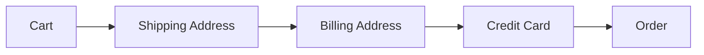
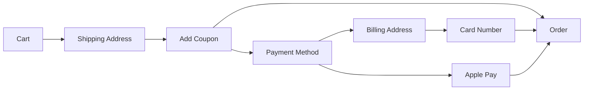

## Navigation at a glance

App navigation describes how the user moves between screens. For example, an app might have this flow as part of the navigation for processing an order:



(Some people include sheets and alerts as part of navigation, but I think that they should be considered separately because conceptually they are temporary views that allow getting some data quickly, without leaving the screen.)

## Direct view-driven navigation

The most direct approach wires each screen to the next inside the view layer (SwiftUI uses NavigationLink, UIKit calls pushViewController):
```swift
struct CartView: View {
   var body: some View {
      ...
      NavigationLink("Continue", destination: ShippingAddressView())
      ...
   }
}

struct ShippingAddressView: View {
   var body: some View {
      ...
      NavigationLink("Continue", destination: BillingAddressView())
      ...
   }
}

...
```
While this is very easy to implement, it comes with a few issues:

- the navigation flow isn't obvious from the code unless you sketch the full diagram
- changing the order (for example, collecting credit card info first) means updating links in multiple places
- because navigation lives in the views, only UI tests can cover it, and those are slow and less reliable than unit tests

In UIKit, Apple provided storyboards as a way to make navigation more visual. Zooming out in the interface builder, you could make the storyboard look very similar to the diagram above. That simplified reasoning about the flow but introduced other problems (for example, if someone changed a storyboard file, it was often very difficult to decipher in code review what actually changed). Apple tried to solve these problems by making storyboards more composable, but in the end, it completely abandoned that approach in SwiftUI.

## Data flow

Another important issue that inevitably comes up in navigation is collecting user data as the user moves through the app. In our example, the user starts with the data about the items that he wants to buy. The next screen adds shipping address, the next one adds billing address, etc. When the user gets to the end, all that data is necessary to complete the order. The simplest way to do this is to keep a struct that gradually gets filled with data as the user navigates through the app:

```swift
struct OrderInfo {
   var cart: Cart?
   var shippingAddress: Address?
   var billingAddress: Address?
   var card: CardInfo?
}
```

Note that all of these variables are optional. This means that when the app reaches the code to actually place an order, it has to assume that every variable contains a value, and if this is not true, it's a programmer's error. In that case, the code might log an assertion failure and possibly ask the user to try again and navigate the user back to some earlier place in the flow. Additionally, we would need to add unit tests that would verify that this never happens.

Another solution is to leverage the compiler to ensure that when the app reaches the code to place an order, all the data is available. One way is to carry this data explicitly through navigation:
```swift
// cart only
NavigationLink("Continue", destination: ShippingAddressView(cart))
...
// cart + shippingAddress
NavigationLink("Continue", destination: BillingAddressView(cart, shippingAddress))
...
```
This works, but now each screen in the flow has to keep track of the data that it doesn't need, and if we change the navigation order, we have to adjust every view to keep different extra data.

## Problems to solve

So far, we discussed the following problems with the basic approach:

- the navigation flow isn't obvious from the code
- testing is difficult
- the data flow allows impossible states

One additional problem is scale: as an app grows larger, its navigation becomes more complex, and without a scalable approach, keeping track of navigation becomes more and more difficult. This problem is similar to a massive view in SwiftUI or a massive view controller in UIKit.

## Using a coordinator

To make navigation testable with regular unit tests, we need to pull the navigation logic from the view layer. This means that instead of calling the navigation APIs directly, we would call a coordinator that would encapsulate the logic and call those APIs as needed. Then, for testing, we could call the coordinator directly, exactly as it would be called in the app, and validate that the coordinator calls the expected APIs and updates its representation of the navigation logic in the expected way. For example, it might look like this in SwiftUI:

```swift

enum Route: Hashable { case cart, shipping, billing, creditCard, order }

enum UserInput {
   case cartContinue
   case shippingSubmitted(Address)
   case billingSubmitted(Address)
   case creditCardSubmitted(CreditCard)
   case orderDone
}

@MainActor
class AppCoordinator: ObservableObject {
   @Published var path = NavigationPath()
   var shippingAddress: Address?
   var billingAddress: Address?
   var card: CreditCard?

   func start() { path = [] } // root shows CartView
   func push(_ r: Route) { path.append(r) }
   func popToRoot() { path.removeLast(path.count) }

   func handle(_ input: UserInput) {
      switch input {
      case .cartContinue:
         push(.shipping)
         
      case .shippingSubmitted(let addr):
         shippingAddress = addr
         push(.billing)
         
      case .billingSubmitted(let addr):
         billingAddress = addr
         push(.creditCard)
         
      case .creditCardSubmitted(let c):
         card = c
         push(.order)
         
      case .orderDone:
         popToRoot()
      }
   }
}
```
and the UI code might look like this:

```swift
NavigationStack(path: $coordinator.path) {
   CartView(onContinue: { coordinator.handle(.cartContinue) })
      .navigationDestination(for: Route.self) { route in
         switch route {
         case .shipping:
            ShippingView(onSubmit: { addr in
               coordinator.handle(.shippingSubmitted(addr))
            })
         case .billing:
            BillingView(onSubmit: { bill in
               coordinator.handle(.billingSubmitted(bill))
            })
         case .creditCard:
            CreditCardView(onSubmit: { card in
               coordinator.handle(.creditCardSubmitted(card))
            })
         case .order:
            OrderView(onDone: { coordinator.handle(.orderDone) })
         }
   }
}
```

The navigation logic is encapsulated in the `handle` method of the coordinator. The method encodes a state machine that describes how to transition to the next state. For example, when `handle` is called with `.shippingSubmitted`, the code implicitly assumes that the current state is `Shipping Address` view and navigates to `Billing Address` view. The actual state is stored in the `path` variable, and a unit test can compare the expected and the actual `path`.

We could split the coordinator into 2 parts to separate the actual navigation (changing the view hierarchy) from the state machine, but for SwiftUI, keeping the `path` variable is enough.

This is a significant improvement over the simplest approach:

- The navigation logic is encapsulated in one function. The diagram is not obvious from the code, but we can easily recreate it by following the transition links (the user input).
- The navigation logic is easy to test.
- The approach is scalable: as the navigation becomes more complex, we can compose the handler from smaller handlers.

On the other hand, the problem with the data flow is still there (we have to use optionals and add assertions and unit tests about impossible states). It is possible to solve this by representing each transition as a separate type, but then we cannot represent navigation as a single synchronous function that describes state transitions.

## Using an async function

If we take a step back and describe the navigation in plain text, it would be like this:

1. start with the cart
2. get shipping address
3. get billing address
4. get credit card
5. order

We can easily translate this into an async function:

```swift
func orderFlow() async -> OrderConfirmation {
   let cart = await getCart()
   let shippingAddress = await getShippingAddress()
   let billingAddress = await getBillingAddress()
   let creditCard = await getCreditCard()
   let confirmation = await order(cart, shippingAddress, billingAddress, creditCard)
   return confirmation
}
```
If we can somehow encode navigation in this way, that would match the logic perfectly. The only problem with this approach is that the user might go back and change what he entered, and our optimistic code doesn't capture that. The fix is to introduce nesting:

```swift
func orderFlow() async -> OrderConfirmation {
   await getCart().then { cart in 
      await getShippingAddress().then { shippingAddress in
         await getBillingAddress().then { billingAddress in 
            await getCreditCard().then { creditCard in 
               await order { 
                  // use cart, shippingAddress, billingAddress, creditCard
               }
            }
         }       
      }
   }
}
```

Now going back in the flow is captured by going to an outer closure.

With this approach, as navigation becomes more complex, we can easily break it down into smaller functions and compose them together. For example, if we want to group collecting billing address and credit card, the code becomes:

```swift
func getCreditCardInfo() async -> (Address, CardInfo) {
   await getBillingAddress().then { address in
      await getCreditCard().then { card in
            (address, card)
      }
   }
}

func orderFlow() async -> OrderConfirmation {
   await getCart().then { cart in 
      await getShippingAddress().then { shippingAddress in
         await getCreditCardInfo().then { (address, card) in
            await order { 
               // use cart, shippingAddress, billingAddress, creditCard
            }
         }       
      }
   }
}
```

So far we only considered a linear flow. Let's see what happens if we introduce branching. For example, let's add a screen where the user can add a coupon and another screen where he can select the payment method:



Then the order flow becomes:

```swift
func orderFlow() async -> OrderConfirmation {
   await getCart().then { cart in 
      await getShippingAddress().then { shippingAddress in
         await getCoupon(cart).then { (coupon, price) in
            if price == 0 {
               await order {
                  // use cart, shippingAddress, coupon
               }
            }
            else {
               await getPaymentMethod().then { method in 
                  switch method {
                  case .card:
                     await getBillingAddress().then { billingAddress in 
                        await getCreditCard().then { creditCard in 
                           await order { 
                              // use cart, shippingAddress, coupon, billingAddress, creditCard
                           }
                        }
                     }

                  case .applePay:
                     await getApplePayInfo().then { applePayInfo in
                        await order {
                           // use cart, shippingAddress, applePayInfo
                        }
                     }
                  }
               }
            }
         }
      }
   }
}
```

This is the clearest representation of the flow. It's very intuitive and compact, and it completely matches the logic that we want to express. We don't have to worry about non-existent states, and we have access to the collected data at every point in the flow. This works because we are using nested functions to represent navigation, and the navigation stack is represented by function call stack.

Right now this is still pseudo code though because we haven't specified how views actually show up in the app and how we call Apple's APIs to navigate from view to view. It's also not clear how the data is transferred from the view to the nested context. The next post will be all about those details. If you'd like to see a working example of this style of navigation, take a look at [SyncUpsTRA](https://github.com/ilyathewhite/SyncUpsTRA) -- an implementation of SyncUps ([Point-Free example](https://github.com/pointfreeco/syncups)) using [TRA](https://github.com/ilyathewhite/ReducerArchitecture) (my reducer architecture package based on a very early version of [TCA](https://github.com/pointfreeco/swift-composable-architecture/tree/main)). The actual navigation code for SyncUpsTRA is [AppFlow.swift](https://github.com/ilyathewhite/SyncUpsTRA/blob/master/SyncUps/UI/AppFlow/AppFlow.swift).
